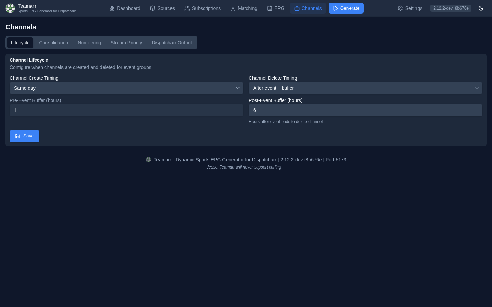

# Lifecycle

Controls when event channels are created in and deleted from Dispatcharr.

## Create Timing

| Mode | Description |
|------|-------------|
| **Same day** | Create channels on the day of the event |
| **Before event + buffer** | Create channels a configurable number of hours before the event starts |

The **Pre-Event Buffer (hours)** field is greyed out until **Before event + buffer** is selected; it sets how many hours before the event to create the channel (0–336 hours, default 1).

For session-based events (race weekends, UFC card segments), each session's channel is timed against that session's own start — the Sunday race channel appears on race day (or race start minus buffer), not when Friday practice enters the window.

Channels are never created for events that are already over: final events are excluded (an API-only `include_final_events` setting can override this), an event not yet reported final is treated as final two hours after its estimated end, and an event already past its delete threshold is skipped entirely.

## Delete Timing

| Mode | Description |
|------|-------------|
| **Same day** | Delete channels at the end of the event's day (23:59 on the day the event is estimated to end) |
| **After event + buffer** | Delete channels a configurable number of hours after the event ends |

The **Post-Event Buffer (hours)** (0–336, default 1) sets how many hours after the event ends to keep the channel (e.g., 2 hours for postgame coverage). "Ends" is an **estimate**: start time plus a per-sport default duration (configurable under [EPG → Output](../epg/output#default-durations)). For session-based events like race weekends, the creation-time window uses the last session's start plus its duration; the per-run recalculation uses each channel's own start time plus the sport duration.

{: .note }
Events that cross midnight always use the post-event buffer for deletion, even in "Same day" mode, so a channel isn't pulled out from under a game in progress.

Deletion times are **recalculated from current settings on every run** — changing the buffer retroactively re-times channels that already exist.

## How channels get deleted

The timing above is only one of several deletion paths. Each generation run also performs these cleanups:

- **Vanished or rotated streams** — when a stream disappears from the M3U, its content changes, or it rotates to a different event, it's detached from the channel. The channel itself is deleted only when *no* valid streams remain. This runs regardless of delete timing.
- **Disabled sources** — disabling a source detaches its streams stream-by-stream; a channel is deleted only if nothing else feeds it (consolidated channels survive).
- **Unsubscribed leagues** — unchecking a league in [Subscriptions](../subscriptions) deletes that league's channels on the next run.
- **Orphan cleanup** — Teamarr-tagged channels in Dispatcharr that aren't tracked locally are removed.

Deleted channels appear in the **Recently Deleted** section of the [Dashboard](../dashboard#managed-channels).

## Sync reliability

Channel create/update/stream writes to Dispatcharr are confirmed before Teamarr's local record updates — if a Dispatcharr API call fails, the local state stays unchanged and the drift is detected and corrected on the next generation run. Profile assignments self-heal the same way, by comparing against Dispatcharr's actual state. Channels whose actual state has diverged show a **Drifted** badge in the Dashboard's Managed Channels table until the next run corrects them.
