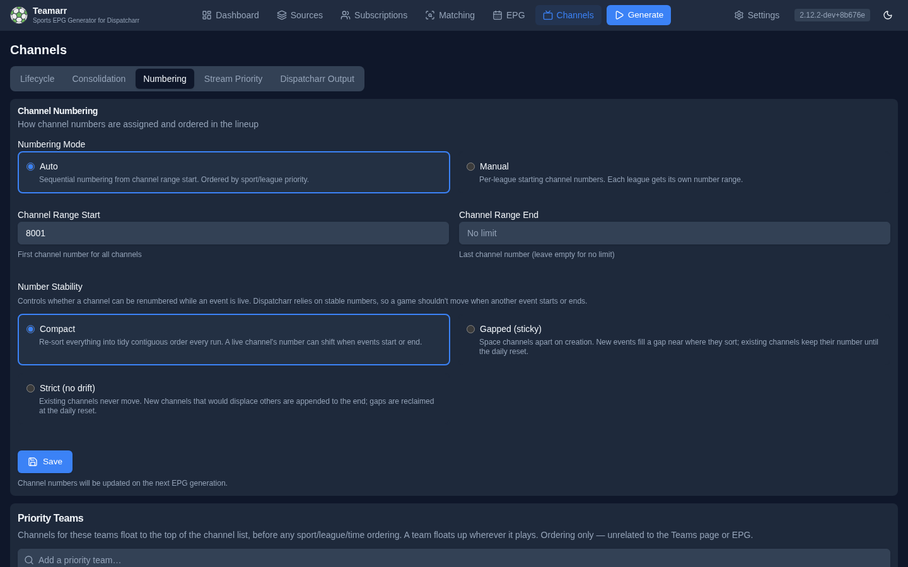

# Numbering

How channel numbers are assigned and how channels are ordered within the lineup.

The page lists rules **most-specific first** — a channel takes the first rule that
matches it:

1. **[Priority Teams](#priority-teams)** — a team's games float to the top of its league, its sport, or everything.
2. **[Pinned Blocks](#pinned-blocks)** — a team, league, or sport gets its own block of numbers starting wherever you say.
3. **[Sport & League Order](#sport--league-order)** — the lineup order used inside every block and in Everything Else.
4. **[Everything Else](#everything-else)** — the range for whatever no block claims.
5. **[Number Stability](#number-stability)** — whether numbers may move while a game is live (global; applies inside all of the above).

Priority Teams, Pinned Blocks, and Sport & League Order save as you edit; Everything
Else and Number Stability save with the button at the bottom.

## Priority Teams

Add a team and its games float to the top of a scope you pick per team:

| Scope | Meaning |
|-------|---------|
| **Top of its league** (default) | First among that league's games; the sport and league order is untouched. Pin MLB at 550 and set the Brewers here, and every Brewers game sits at the start of the MLB block. |
| **Top of its sport** | First among every league in the sport — Tigers above all baseball, MiLB included. |
| **Top of everything** | Ahead of every sport and league. (This was the only behaviour before v2.15; existing entries were kept on it.) |

A team floats up wherever it plays (league and cup), matched by name within its sport. Pinned blocks are carved out *after* the lineup is sorted, so a priority team only moves relative to the other channels in the same block. This is purely an ordering preference — it has no connection to the [Teams](../epg/teams) page or EPG generation.

## Pinned Blocks

A pinned block gives a **team**, **league**, or **sport** its own block of channel numbers starting at a number you choose. For example:

| Start | Scope | Result |
|-------|-------|--------|
| 800 | Team · Detroit Lions | The Lions team channel and every Lions game, from 800 |
| 850 | Group "Big events" · FIFA World Cup, Olympics | Both competitions share one block from 850 |
| 1700 | League · NFL | Every other NFL game from 1700 |
| 8000 | *(Everything Else start)* | Everything else |

**Add block** picks the scope (the team picker, a league, or a sport), a start channel, and optionally a group name. Blocks that share a group name *and* start share one block of numbers — type an existing group's name and its start fills in.

Rules:

- **Most specific wins.** A channel goes to the team block if either team is pinned, else the league block, else the sport block, else Everything Else. When both teams are pinned, the **home** team's block wins.
- **A block can start anywhere** — above, below, or inside the Everything Else range. Everything Else flows around it (range 101+, Lions at 105: everything else uses 101–104, the Lions block 105–106, everything else resumes at 107).
- **Each start belongs to one block.** Teamarr refuses a second block at a start that's already taken unless both carry the same group name (then they share it). Pinning "Brewers at 550" *and* "MLB at 550" is not a way to put the Brewers first — it would merge both into one block in normal lineup order. To float a team to the top of its league's block, add it under [Priority Teams](#priority-teams); to give it its own numbers, pick a different start.
- **A team pin follows the team everywhere** — league games and cup games alike, matched by name within the sport (the same rule Priority Teams use).
- **Feeds stay together.** Home/away feeds and keyword variants of one game land on adjacent numbers inside the block, exactly as in Everything Else.
- **Blocks spill forward.** A block with more channels than room simply continues past its start; the next block skips over it (you'll see a ⚠ in the effective-layout preview). Set an **end channel** (under *advanced*) if you'd rather overflow into Everything Else.
- **Disable** a block with its switch to keep it without applying it.

Block changes are saved immediately and queue a re-grid in Gapped/Strict modes, so they take effect on the next generation. The list is shown in placement order (lowest start first), and the **effective layout** strip under it shows where today's channels would land — Everything Else included, wherever it falls.

Inside every block, channels follow the same [Sport & League Order](#sport--league-order) as Everything Else: priority teams first, then sport and league order, then start time. A **sport** block is the simplest way to keep all of one sport together — soccer at 500 numbers every soccer league back-to-back in your league order, with no per-league starts to maintain.

{: .note }
**Upgrading from Manual mode.** Manual mode's per-league starting channels became league-scoped pinned blocks automatically — same starts, same numbers. Leagues that had no configured start now share Everything Else in lineup order instead of each restarting at the range start (which could hand two leagues the same number).

## Sport & League Order

The order sports and leagues take inside Everything Else and inside every pinned block. Drag sports to reorder; expand a sport to reorder its leagues. Higher in the list = lower channel numbers; games within a league sort by start time; sports and leagues not in the list go last. Click **Auto-populate** to pre-fill with all currently subscribed sports and leagues.

The full order, applied inside each block and inside Everything Else, is: **Priority Teams (everything) → Sport → Priority Teams (sport) → League → Priority Teams (league) → Event time**, with two deterministic tie-breakers after that — event id, then main channel before its keyword variants (your Spanish feed always sorts right after the main channel).

## Everything Else

| Field | Description |
|-------|-------------|
| **Everything Else Start** | First channel number for channels no pinned block claims. |
| **Everything Else End** | Last channel number for those channels — leave empty for no upper limit. If a run fills the range, allocation stops there (with a log warning) rather than numbering past the end. Pinned blocks are not limited by it. |

Teamarr automatically **skips numbers already used by non-Teamarr channels** in Dispatcharr (and by pinned blocks that start inside this range), and logs a warning when the configured range overlaps external channels. Setting the start above your existing channels (e.g., 1000 if you use 1–500) is still tidier — contiguous blocks without skips — but collisions are prevented either way.

## Number Stability

Controls whether a channel can be **renumbered while its event is live**. Dispatcharr relies on channel numbers staying put, so a game shouldn't jump numbers just because another event started or ended.

| Mode | Behaviour |
|------|-----------|
| **Compact** | Re-sorts every channel into tidy contiguous order on every run (the default). A live channel's number can shift when events start or end. |
| **Gapped (sticky)** | Channels are spaced apart by the **gap size** (e.g. 3 → 101, 104, 107). A new event slots into a free number near where it sorts (filling a gap, or reusing a slot freed by an ended event); existing channels keep their number for the whole event lifecycle. A new event that sorts above everything with no room below is appended to the end of the used range until the next re-layout. |
| **Strict (no drift)** | Existing channels never move. **Every** new event is appended to the end of the used range, regardless of where it would sort. Gaps left by ended events are reclaimed only at the daily reset. |

You can't have perfectly priority-ordered numbers *and* numbers that never move — the sticky modes choose stability between resets and restore ordering at the daily re-layout. If strict ordering at the top of the lineup matters more, keep **Compact**.

In Gapped and Strict modes, existing numbers change outside the daily re-layout only in two edge cases: a channel whose number now **collides with an external Dispatcharr channel** (or falls outside a changed range) is re-placed on the next run, and a keyword-variant channel that ended up numbered *below* its main channel is swapped with it so the main channel always has the lower number.

{: .note }
**Feeds and keyword variants stay together.** When feed separation or exception keywords split an event into multiple channels, they're treated as one block on **adjacent** numbers — the gap is only applied *between* events. With gap size 3, a 3-feed event fills 101–103 and the next event starts at 106 (a full gap always follows the block).

### Daily Re-Layout

To stop gaps accumulating and to restore priority order, a full re-grid runs once per day. It is gated into your generation schedule: the **first generation at or after the configured reset time** re-grids every channel, then it won't run again until the next day.

| Field | Description |
|-------|-------------|
| **Gap Size** | (Gapped mode) spacing between channels at reset. Larger gaps leave more room for late events to slot in without moving anyone. |
| **Daily re-layout** | Toggle the periodic re-grid on/off. With it off, numbers stay sticky indefinitely and gaps are never reclaimed automatically. |
| **Reset Time** | Local time of the low-traffic window for the re-layout (default `04:00`). |

{: .note }
Reset Time is the **server's** local time. In Docker this is usually UTC unless you set the container `TZ` — pick the value accordingly.

### Re-grid now

You don't have to wait for the daily window. **Re-grid channels now** (shown in Gapped/Strict modes only) queues a one-shot re-layout that runs on the **next generation** — renumbering every channel back into priority order and reclaiming gaps, regardless of the reset time and even if the daily re-layout is turned off. The flag clears once that run completes.

Changing the **gap size**, switching **stability mode**, adjusting **Everything Else**, editing **pinned blocks**, or changing **Sport & League Order / Priority Teams** queues the same re-grid automatically, so the change takes effect on the next run instead of silently waiting for the daily reset.

{: .note }
Number Stability applies **inside every pinned block** as well as Everything Else: with Gapped and gap size 3, a block starting at 800 lays out 800, 803, 806…; the daily re-layout re-grids each block from its own start.
