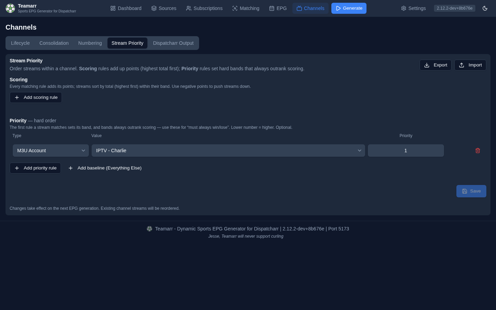

# Stream Priority

Configure rules for ordering streams within consolidated channels. When multiple streams are merged into a single channel (see [Consolidation](consolidation)), these rules determine which stream is listed first — the "primary" stream.

This is distinct from [channel ordering](numbering#channel-ordering), which controls a channel's position in the lineup.

With no rules configured, streams simply keep the order they were added in — generation performs no reordering.

## Two ways to rank: Scoring and Priority

Every rule belongs to one of two classes, added with the separate **Add scoring rule** and **Add priority rule** buttons. Both use the same [rule types](#rule-types) — the difference is *how* a match affects ordering.

| Class | How it ranks | When to use |
|-------|--------------|-------------|
| **Scoring** | Additive. Each matching rule adds its signed **points**; a stream's points are summed and the highest total sorts first. Negative points push a stream down. | The everyday case — nudge streams up or down by several attributes at once (preferred provider, HD, right feed) and let the totals decide. |
| **Priority** *(hard order)* | The first Priority rule a stream matches sets its **band** (1–99). Bands always outrank scoring, so a Priority match is a hard "must always win / must always lose". Lower number = higher priority. | Escape hatch for absolutes: "streams from this account always come first," "EPG-matched streams always come last." |

**How the two combine.** A stream is ranked by its hard band first, then by its total score *within* that band, then by the order it was added. Because bands are strict, no amount of score moves a stream out of its band — scoring only reorders streams that share a band. Streams that match no Priority rule fall into the baseline band (see [Everything Else](#the-everything-else-baseline)).

**Example — push EPG-matched streams to the back:** a Scoring rule *M3U Account = "Premium IPTV"* at **+100** plus a Scoring rule *Stream Type = EPG matched stream* at **−100000**. Premium streams float up; anything EPG-matched sinks below everything, premium or not.

## Rule Types

Any rule type can be used as a Scoring rule or a Priority rule.

| Type | Description | Example |
|------|-------------|---------|
| **M3U Account** | Match streams from a specific M3U account | "Premium IPTV" → +100 |
| **Event Group** | Match streams from a specific source | "ESPN+ Group" → +20 |
| **Regex Pattern** | Match streams whose name matches a regex (case-insensitive) | `1080p` → +15 |
| **Stream Type** | Match by how the stream was recognized: **event stream**, **team stream**, or **EPG matched stream**. Optionally narrow a team-stream rule to specific teams. *EPG matched stream* covers streams attached via [EPG program-data matching](../matching/program-matching) — i.e. time-shared linear channels (ESPN, FS1) matched to events through Dispatcharr's program guide. The three types are mutually exclusive: an EPG-matched stream only ever matches the *EPG matched stream* option, never *event* or *team* — regardless of rule order. | Team stream → +10 |
| **Specific Team's Feed** | Match streams identified as a *particular* team's own broadcast — via the matching engine's resolved feed team or, as a fallback, home/away markers in the stream name. Pick one or more teams. **Invert** flips it to match feeds that are *not* your selected teams (useful for pushing other teams' feeds down). | Selected teams → +30 |
| **Feed Side** | Match the **home** or **away** side's feed for whichever teams are playing — no team selection needed. Use it for a standing preference like "always give me the home broadcast." Streams whose side couldn't be determined match **neither** option; see the note below. | Home side's feed → +30 |
| **Dispatcharr Group** | Match channel-source streams by their Dispatcharr channel group. The dropdown lists the groups you selected under [Dispatcharr as a Stream Source](../matching/program-matching#dispatcharr-channels-as-an-epg-source). Only channel-source streams carry a Dispatcharr group; regular matched streams are unaffected. | "US \| Sports" → +5 |
| **Stream Stats** | Match streams whose quality meets numeric thresholds — **resolution width/height**, **source FPS**, **output/audio bitrate**, or **sample rate** — using `>`, `<`, `>=`, `<=`, `=`, or **Unknown** (matches streams with *no* value for the metric). Combine several conditions (all must pass). Use it to float HD / high-bitrate streams ahead of lower-quality ones — or use *Unknown* to demote unprobed streams. | `resolution_height >= 1080` and `source_fps >= 50` → +25 |
| **Everything Else** | Optional catch-all baseline for any stream not matched by a Priority rule. Only meaningful as a **Priority** rule — it sets the band unmatched streams land in. | Everything else → priority 99 |

{: .note }
**Stream Stats** values come from Dispatcharr's stream probe and are cached per stream. The cache refreshes when you *view a channel's streams* in the Dashboard (and the stats are missing or older than an hour) — generation itself never probes, it uses whatever is cached. Practical consequence: a Stream Stats comparison rule may not match a channel's streams until you've opened that channel in the Dashboard at least once. For the comparison operators, a stream with no value is treated as not matching; the **Unknown** operator matches exactly those streams.

### Points

Scoring rules take a **signed integer** in the Points column (±100000 max). New scoring rules start at **+10**. Positive points promote a stream, negative points demote it, and totals accumulate across every scoring rule a stream matches. There is no need to space values out — points only ever compete *within* a band, so `+1`/`+2`/`+3` ranks the same as `+10`/`+20`/`+30`.

### The "Everything Else" baseline

A catch-all is **not added automatically**. Streams that match no Priority rule fall to the default baseline band (999 — you'll see it in the priority explainer), so you only need an explicit **Everything Else** row when you want to place that baseline at a specific priority relative to your other Priority bands. Add one with the **Add baseline (Everything Else)** button in the Priority section; there can only be one.

### Feed side is home, away, or unknown

**Feed Side** rules read a side Teamarr resolved and stored when the stream was attached — from an explicit HOME/AWAY marker in the stream name, from the side of the team that matched, or by comparing the resolved feed team against the event's two teams.

When none of those produce an answer, the side is **unknown**, and unknown is a real answer rather than a fallback to the other side. A stream is unknown when:

- it carries no feed signal at all (a national broadcast, a generic listing) — the common case;
- a feed team resolved but matches neither team in the event;
- the sport has no home and away at all (racing, combat sports, individual events).

An unknown stream matches **neither** the Home nor the Away rule and falls through to [Everything Else](#the-everything-else-baseline). It is never treated as the opposite side just because it isn't this one. You can see each stream's resolved side in the Dashboard: expand a channel and check the **Feed** column, where unknown shows as `—`.

Existing streams show `—` until their next generation run fills the side in; nothing is back-filled retroactively, because deriving a side for an old row would mean guessing at exactly the rows the guess would be worst for.

{: .note }
At a **neutral-site** game (bowls, tournament finals) Teamarr keeps the provider's nominal home designation rather than forcing unknown — the provider told us a side, so the rule still works there.

### Team filters

Both **Stream Type** (team streams) and **Specific Team's Feed** rules let you pick specific teams. Leaving the team selection empty makes the rule a no-op — a Stream Type rule with no teams matches *all* team streams, while a Specific Team's Feed rule with no teams matches nothing. Use the **Default** button to load your configured team-filter include list, or **Clear** to start fresh. **Feed Side** rules take no team selection at all — they apply to whichever teams are playing.

### How team-feed detection works

The **Specific Team's Feed** rule first checks the **resolved feed team** stored during matching — the [Feed Separation](consolidation#feed-separation) engine's verdict from broadcast-market listings, team-branded names (`Brewers.TV`), and tvg-id/tvg-name. Identification always runs, whether or not the Feed Separation toggle is on (the toggle only controls channel splitting), and team streams (`MLB | Milwaukee Brewers`) carry their matched team the same way. When no team was resolved, it falls back to scanning the stream name for your selected teams plus a feed indicator — a matchup (`vs`, `at`, `@`), a side (`home`/`away`), a camera label, or a `(Team feed)` marker. Generic streams with neither are left for other rules.

## Live events keep their #1 stream

While an event is airing, scheduled generation runs won't displace the channel's top stream — the one a viewer is most likely watching. Rule changes still take effect in the background (priorities are recomputed and stored), and new streams that match mid-event are added **below** the current #1, but the top slot itself stays put until the event ends. The first run after the event restores full rule ordering.

A **manually triggered** generation run bypasses this pin — that's your escape hatch if the pinned stream is the wrong one: fix your rules (or remove the bad stream) and hit Generate.

## Why is a stream ordered this way?

In the **Dashboard's Managed Channels table**, expand a channel and click a stream's priority number to open a popover that explains its ordering against your current rules: the hard **band** it landed in (and which Priority rule, if any, set it), plus each **Scoring** contribution with its points. If the stored number was computed under rules you've since changed, the popover marks it stale so you know a regeneration will re-rank it.

{: .note }
When any scoring rule exists, the stored priority number is an encoding of band and score together (`band × 1,000,000 − score`) — that's why you'll see values like `1000090` in the priority column. Rulesets with only Priority rules keep small numbers (1–99, or 999 for the baseline).

## Export & Import

Use the **Export** and **Import** buttons in the Stream Priority header to back up your rules or move them between instances.

- **Export** downloads your last **saved** rules — including each rule's class (Scoring/Priority) and points — as a `stream-ordering-rules.json` file (the button is disabled until rules are saved). If you have unsaved edits in the editor, Teamarr warns you first — save before exporting if you want those edits included.
- **Import** reads a rules file — either a bare rules array or a `{rules: […]}` envelope — and **replaces** your entire current rule set. Rules with an invalid type, value, or priority are skipped. Older files that predate scoring import fine: rules with no class default to **Priority**. No catch-all is force-added.

Rules that reference an M3U account, source, or Dispatcharr group match by **name**, so they carry over cleanly to another instance as long as the same names exist there. Team-based rules (Stream Type and Specific Team's Feed) reference provider team IDs and only apply to teams present on the target instance. **Feed Side** rules carry no team references at all, so they port cleanly.
