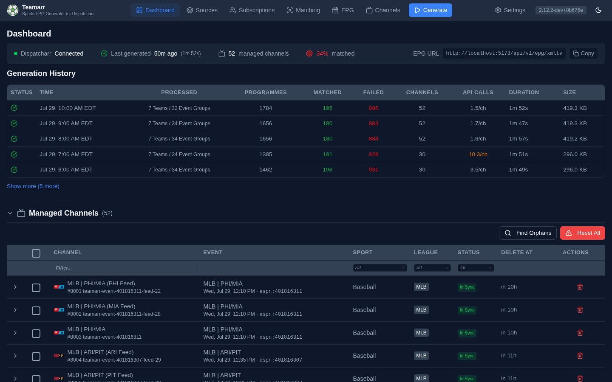

# Dashboard

The dashboard is your landing page — a health-and-control panel. It answers "is my system healthy?" at a glance, surfaces recent generation runs, and holds the managed-channel tables and EPG output preview.

## Status Strip

A read-only strip across the top shows system health at a glance:

| Item | Shows |
|------|-------|
| **Dispatcharr** | Connection state — Connected (green), Disconnected (amber), Error (red, hover for the message), or Not configured |
| **Last generated** | When the last run finished (relative time) and its duration, color-coded by staleness: green under a day, amber 1–3 days, red over 3 days or failed. Shows *Generating…* with a spinner during an active run, and a muted "Never generated" before the first run |
| **Managed channels** | Active Teamarr channel count recorded by the last generation run |
| **Matched** | Overall stream match rate, color-coded (only shown when match data exists) |
| **EPG URL** | The XMLTV URL with a one-click **Copy** button — this is where you grab the URL for Dispatcharr |

{: .note }
During a generation run, the channel and match-rate values show a spinner until fresh numbers land.

## Generation History

A table of recent full-pipeline runs (matching, channels, and EPG). Five show by default; **Show more** expands to the ten most recent.

| Column | Description |
|--------|-------------|
| **Status** | Completed, partial, failed, cancelled, or running (spinner) |
| **Time** | When the run started |
| **Processed** | What was processed in the run |
| **Programmes** | Total programmes generated. Hover for the Events / Pregame / Postgame / Idle breakdown |
| **Matched** | Streams matched to events. Click to open a searchable drill-down of matched streams, filterable by group, with a badge showing how each match was made (Cache, Alias, Fuzzy, Direct, …) and a **Fix** button to correct a wrong match |
| **Failed** | Streams that could not be matched. Click to see each stream's failure reason, and use **Fix** to manually match it via the Event Matcher |
| **Channels** | Active channels after the run |
| **API Calls** | Provider HTTP calls made during the run, shown as calls-per-channel. Hover for the per-provider breakdown. Muted in the normal range; amber/red if call volume per channel climbs abnormally — a quick way to spot a fetch regression |
| **Duration** | How long the run took |
| **Size** | Size of the generated XMLTV file |

## Managed Channels

A collapsible **Managed Channels** table lists the channels Teamarr currently maintains in Dispatcharr, with the channel name, the event it's tied to, sport, league, sync status, and scheduled delete time. The Event column shows a compact matchup (league, then away/home abbreviations — e.g. `MLB | LAA/MIN`; card and racing events show the event name) plus the start time and the provider's native event id (`espn:401816119`).

- **Sync status badges** — In Sync, Pending, Created, Drifted, Orphaned, or Error. Drifted channels are corrected on the next generation run.
- **Expand a row** to see its attached streams with per-stream match detail, priority, and stream health (resolution, fps, bitrate).
- **Find Orphans** detects Teamarr-tagged channels in Dispatcharr that aren't tracked locally; **Reset All**, the multi-select bar, and a per-row delete button handle removals. Sport and League dropdowns filter the table, and a **Pending Deletions** banner appears when channels are scheduled for removal.

A separate **Recently Deleted** section lists channels removed by event cleanup (channel, event, sport, league, and when they were deleted).

## EPG Output (XML Preview)

A collapsible **XML Preview** section contains:

- **EPG analysis** — coverage gaps and unreplaced-variable warnings, or an all-clear if the output is clean
- A searchable preview of the generated XMLTV file

## All-Time Totals

A compact footer shows lifetime totals: generations, programmes, streams matched, channels created, channels deleted, cache hits, and average run time.

These totals are genuinely all-time: before old run records are pruned from the run history (or cleared via **Clear Run History** on Settings → Advanced), their sums are folded into a lifetime accumulator, so the totals keep growing across the retention window. Only full EPG generations count, except cache hits, which are tallied from per-source sub-runs. Average run time reflects the retained run window only. The accumulator shipped in v2.9.0 and starts from the run history present at upgrade.
