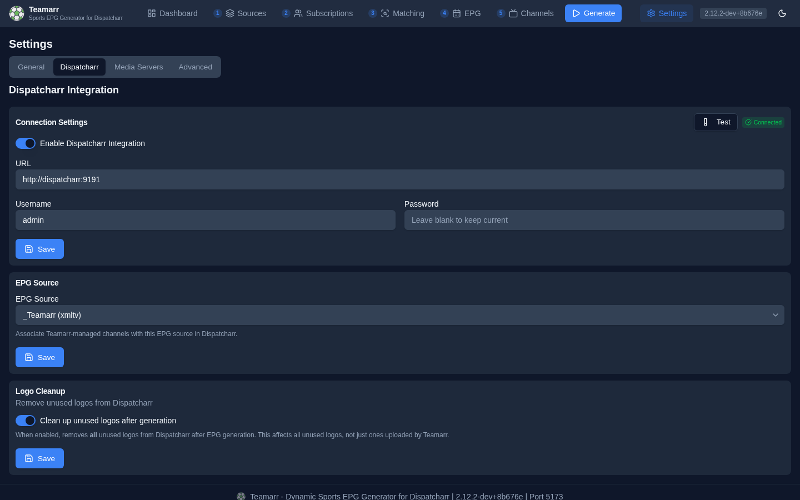

# Dispatcharr Integration

Teamarr creates and manages channels in Dispatcharr automatically. This guide covers initial setup and how the integration works day-to-day.

## Initial Setup

### 1. Connect to Dispatcharr

1. Go to **Settings → Dispatcharr**
2. Enable the integration toggle
3. Enter your Dispatcharr URL (e.g., `http://dispatcharr:9191`)
4. Enter your Dispatcharr username and password
5. Click **Test** — a successful test reports the connected account, group, and channel counts
6. Click **Save**



### 2. Set Up EPG Source

1. Copy the **EPG URL** from the right end of the [Dashboard](dashboard) status strip (e.g., `http://teamarr:9195/api/v1/epg/xmltv`)

   

2. In **Dispatcharr**, add a new EPG source using that URL
3. Back in **Teamarr Settings → Dispatcharr**, select your Teamarr EPG source from the dropdown (it activates once the connection is live)
4. Click **Save**

### 3. Configure Channel Output

Go to **Channels → Dispatcharr Output** to configure where Teamarr channels land:

- **Default Channel Profiles** — which Dispatcharr profiles Teamarr channels appear in
- **Default Stream Profile** — which stream profile to assign to streams
- **Default Channel Group** — a static group, or a dynamic pattern like `{sport} | {league}` that auto-creates groups (`{conference}` also available for NCAA leagues)


See [Channels → Output](channels/output) for details on each option, including per-league overrides.

## How It Works

Once connected, each generation run manages the full channel lifecycle in Dispatcharr:

1. **M3U accounts are refreshed** so matching sees the latest streams
2. Teamarr **matches streams to events** and resolves templates
3. **Channels are created** with names, logos, EPG data, streams, and profile/group assignments
4. **Channels are updated** when event data changes (scores, status, streams), **deleted** when events end (based on [lifecycle timing](channels/lifecycle)), and drift is reconciled
5. **Dispatcharr's EPG source is refreshed** and channels are associated with their guide data
6. Configured **media servers** (Emby, Jellyfin, Channels DVR) are refreshed in parallel

### Profile & Group Sync

Teamarr enforces profile and group assignments on every generation run. If someone manually changes a channel's profiles in Dispatcharr, Teamarr corrects it on the next run. Dynamic wildcards (`{sport}`, `{league}`, and `{conference}` for groups) automatically create profiles and groups in Dispatcharr if they don't exist.

### Reconciliation

Teamarr detects drift between its expected state and Dispatcharr's actual state. On the [Dashboard](dashboard)'s Managed Channels table:

- **Drifted** channels have mismatched profiles, streams, or settings — corrected on the next generation
- **Orphaned** channels exist in Dispatcharr but aren't tracked by Teamarr — use **Find Orphans** to detect and clean them up

### Logo Cleanup

**Settings → Dispatcharr** also has an optional **Logo Cleanup** toggle that removes **all** unused logos from Dispatcharr after each generation — not just Teamarr-uploaded ones, so use with care if you keep a manually curated logo library.

## Network Configuration

Teamarr and Dispatcharr need to be able to reach each other over the network.

### Docker Compose (Same Host)

If both containers are on the same Docker network, use the container name as the hostname:

```yaml
# Teamarr Settings > Dispatcharr URL:
http://dispatcharr:9191

# Dispatcharr EPG source URL:
http://teamarr:9195/api/v1/epg/xmltv
```

### Separate Hosts

Use the IP address or hostname of each server:

```
# Teamarr → Dispatcharr
http://192.168.1.100:9191

# Dispatcharr → Teamarr EPG
http://192.168.1.101:9195/api/v1/epg/xmltv
```

Connection problems? See [Troubleshooting](troubleshooting#dispatcharr-connection).
