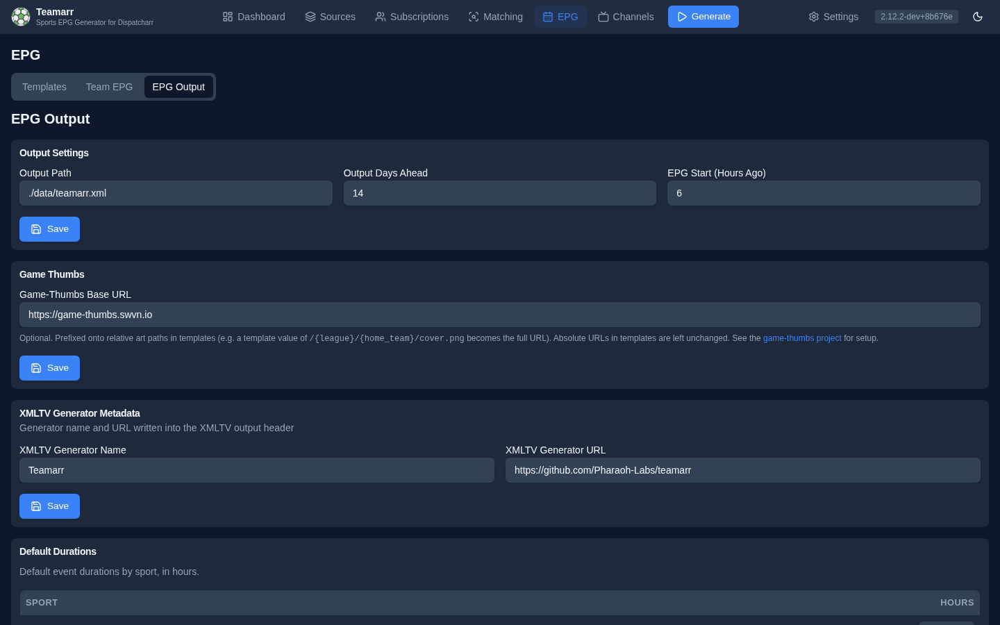

# Output

**EPG → EPG Output** (the sub-nav tab is labeled "EPG Output") configures the XMLTV file Teamarr writes: where it goes, how much it covers, the Game Thumbs base URL, default event durations, and the generator metadata embedded in it.

{: .note }
Running a generation, previewing the XML, and reviewing run history live on the [Dashboard](../dashboard). This page is only the output *settings*.

## Output Path

Where to write the generated XMLTV file. Default: `./data/teamarr.xml`.

The file is also served live at a copyable **XMLTV URL** (e.g. `http://host:9195/api/v1/epg/xmltv`) — the copy button is on the [Dashboard](../dashboard) status strip. Point Dispatcharr or a media player at that URL rather than the file path.

## Output Window

- **Output Days Ahead** — how many days of EPG data to include (default 14).
- **EPG Start (Hours Ago)** — how many hours of already-started events to keep, so games still in progress aren't dropped from the guide.

## Game Thumbs

The **Game-Thumbs Base URL** field lives on this page — the host (and port) prefixed onto every relative art path in your templates at generation time. See [Game Thumbs](game-thumbs) for the integration and [Artwork & Game Thumbs](variables#artwork--game-thumbs) for the path rules.

## Default Durations

Default event durations (in hours) per sport, used when an event's real duration is unknown:

| Sport | Default | Sport | Default |
|-------|---------|-------|---------|
| Basketball | 3.0 | MMA | 5.0 |
| Football | 3.5 | Boxing | 4.0 |
| Hockey | 3.0 | Tennis | 3.0 |
| Baseball | 3.5 | Golf | 6.0 |
| Soccer | 2.5 | Cricket | 4.0 |
| Rugby | 2.5 | Volleyball | 2.5 |
| Racing | 3.0 | *Default (other)* | 3.0 |

## XMLTV Generator Metadata

Customize the generator name and URL written into the XMLTV header (default `Teamarr` and the project GitHub URL). Some media servers use these to identify the EPG source.
