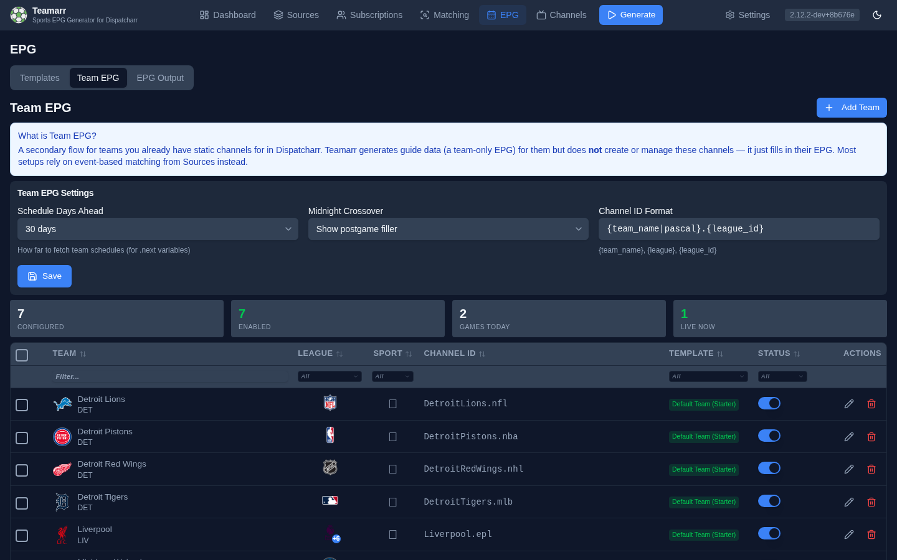

# Teams

Team-based EPG produces one persistent **XMLTV channel** per team in the guide Teamarr writes. Teamarr does *not* create a Dispatcharr channel for each team — that's only done for event-based workflows. Instead, you point one of your existing Dispatcharr channels at the team's XMLTV channel id (via Dispatcharr's normal EPG association), and Teamarr keeps that XMLTV channel populated with the team's schedule — upcoming games, live events, and recent results.

## How It Works

1. Import teams from the league cache
2. Assign a **team template** to each team
3. Teamarr looks up each team's schedule and writes EPG programmes for that team's XMLTV channel

Each team's EPG includes:
- **Pregame** programmes before the game starts
- **Live event** programmes during the game
- **Postgame** programmes after the game ends
- **Idle** programmes on days with no games

## Importing Teams

Go to **EPG → Team EPG** and click **Add Team** to browse the league cache by sport.

1. Click a sport to expand its leagues
2. Click a league to see available teams
3. Select teams individually or use **Select All**
4. Click **Import Selected Teams**

For NCAA football and basketball, a **conference filter** appears next to the team search — pick a conference (SEC, Big Ten, …) to narrow the list, then **Select All** grabs the whole conference at once. Conference membership comes from ESPN's season-scoped data and refreshes with the team cache, so realignment is picked up automatically. Other college sports have no ESPN conference data, so the filter doesn't appear for them.

Teams are grouped by sport in the sidebar. The badge next to each sport shows how many importable leagues it has; each league shows its cached team count. Leagues with 0 teams haven't had their cache refreshed yet — use the cache refresh on **Settings → Advanced** (Data Caches).

## Managing Teams

The Teams table lists all imported teams. Columns are sortable, and a filter row under the header narrows the list.

| Column | Description |
|--------|-------------|
| **Team** | Team name with logo |
| **League** | League the team belongs to |
| **Sport** | The team's sport |
| **Channel ID** | XMLTV channel id — point a Dispatcharr channel at this id to wire up the EPG. Generated as PascalCase team name + league (e.g. `DetroitLions.nfl`) at import; regenerate in bulk with a custom format via the **Channel ID** action after selecting rows |
| **Template** | Assigned template (click to change) |
| **Status** | On/off toggle — inactive teams are excluded from EPG generation |
| **Actions** | Per-team actions (delete, etc.) |

### Assigning Templates

Each team needs a **team template** assigned — see [Team vs Event](team-vs-event) for how team templates differ. Edit a team (pencil icon) to change its template, or select multiple rows and use **Assign Template** to bulk-assign.

## Team EPG Settings

The **Team EPG Settings** card at the top of the page holds the behavior settings:

### Schedule Days Ahead

How far ahead to fetch team schedules. This affects the `.next` template variables that show upcoming games. More days means more programmes in the EPG but longer generation times. Default is 30 days. Options: 7, 14, 30, 60, or 90 days.

### Midnight Crossover

Controls what filler content is shown when a game crosses midnight:

- **Show postgame filler** — Display postgame content after midnight
- **Show idle filler** — Display idle/off-air content after midnight
