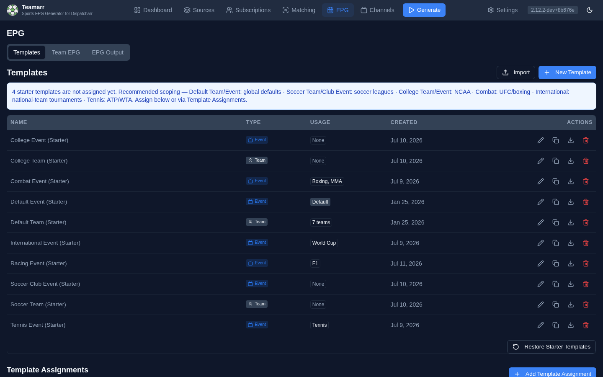
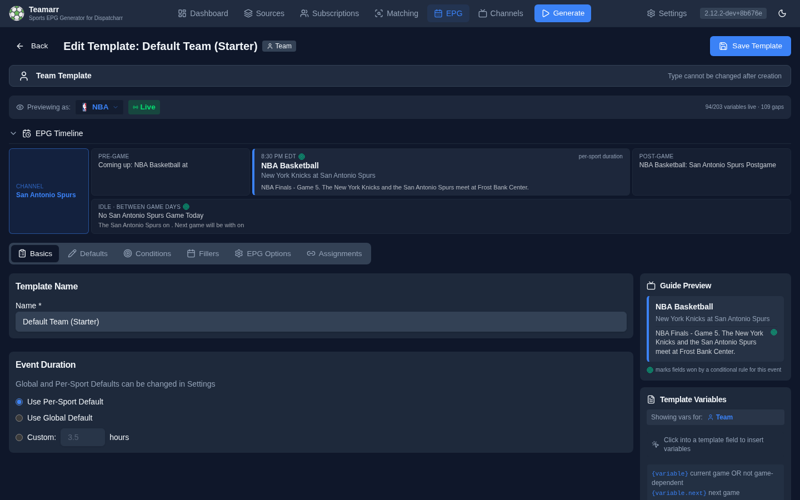

# Templates

Templates define how your EPG content looks - the titles, descriptions, and artwork for programmes in your guide.

**New install?** Teamarr ships with a curated set of
[starter templates](../templates/defaults) modeled on
professional (Gracenote) EPG conventions — you don't need to build templates
from scratch. Assign the starters that match your setup and customize later.

## What Templates Do

When Teamarr generates EPG, it uses templates to create programme entries. Templates contain:

- **Title, subtitle, and description formats** using variables like `{team_name}`, `{opponent}`, `{game_time}` — see [Variables](variables)
- **Filler content** for pregame, postgame, and idle periods, with optional [condition rows](conditions#filler-condition-rows)
- **Conditional logic** to show different descriptions based on game context — see [Conditions](conditions)
- **XMLTV metadata** like categories and flags

A single template can serve many teams or events — team templates are assigned per team, event templates via sport/league [assignment rules](assignments).

## Template Types

### Team Templates

For **team-based EPG** where each team has a dedicated channel (e.g., "Detroit Lions", "LA Lakers").

- Channel persists 24/7
- Content shown from the team's perspective ("we play the Bears")
- Includes idle content for days without games
- Supports `.next` and `.last` suffixes to reference upcoming/previous games (where the variable allows them)

### Event Templates

For **event-based EPG** where channels are created dynamically for each game.

- Channels appear around game time and disappear after
- Content is positional ("away team @ home team") rather than team-specific
- No idle content needed (no channel when no game)
- No `.next` or `.last` suffixes needed - each channel references only one event
- Applied to events matched from your [Sources](../sources/), routed by [assignment rules](assignments)

See [Team vs Event](team-vs-event) for the full comparison.

## Template Form Tabs

The template editor has five tabs (six when editing — an **Assignments** tab is added):

| Tab | Purpose |
|-----|---------|
| **Basics** | Template name and event duration settings |
| **Defaults** | Title, subtitle, description(s), artwork URL, and channel name/logo (event templates) |
| **Conditions** | Rules that show different descriptions based on game context (both template types — event templates get the event-scoped condition set) |
| **Fillers** | Pregame, postgame, and idle content, each with optional condition rows |
| **EPG Options** | XMLTV categories, tags (new/live/date), and video quality |
| **Assignments** *(edit only)* | This template's assignment rules — or, for team templates, the teams using it |

When **creating** a template, every tab is pre-filled with working defaults: a **Next** button below each tab walks you through them in order, and each tab in the strip carries a small hint — a check once you've reviewed it, an amber dot if something required (the template name) is still missing. Tabs stay freely clickable, and editing an existing template shows no stepper at all.

The **Previewing as** bar above the tabs selects the league (and live vs. sample data) for every preview on the page. Below it, the **EPG Timeline** strip shows how the day's programmes lay out, and the **Guide Preview** card in the right rail renders the title, subtitle, and description as a viewer's guide would show them — see [Previewing Templates](variables.md#previewing-templates).

The editor also validates as you type — unknown variable names and unsupported suffixes are flagged inline as advisory warnings (they never block saving; unknown tokens render literally in the output).

## Getting Started

The fastest path is the shipped starter set — every install seeds ten
Gracenote-modeled templates covering team channels, US pro events, soccer
(club and international), college, combat, tennis, and racing.
See [Starter Templates](../templates/defaults) for the full
set and recommended scoping.

1. Go to **EPG → Templates** — the starter templates are already there, unassigned
2. Assign the ones that match your setup (per sport/league, or as global
   defaults) via **Template Assignments**
3. Rename or edit freely — an edited starter is yours and never touched by
   upgrades

To build your own from scratch:

1. Go to **EPG → Templates** and click **New Template**
2. The type defaults to **Event** — a one-click toggle switches to **Team** (this cannot be changed later)
3. Fill in the defaults with your preferred formats
4. Optionally configure fillers and conditions
5. Save, then assign the template — to teams, or via assignment rules
