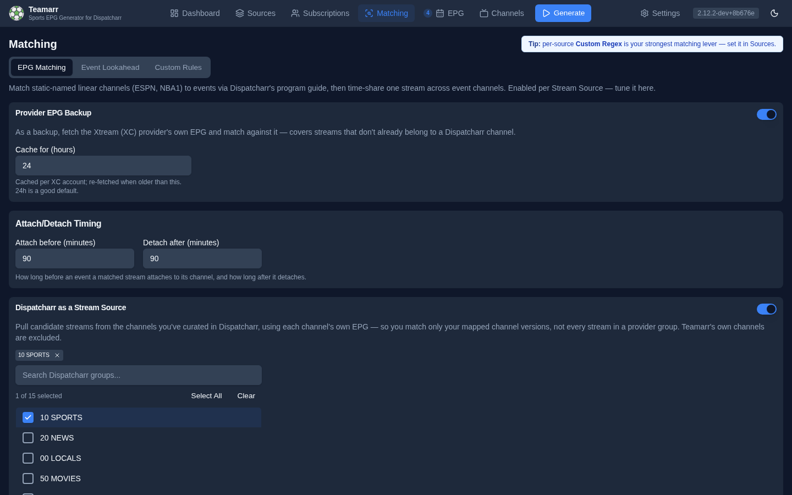
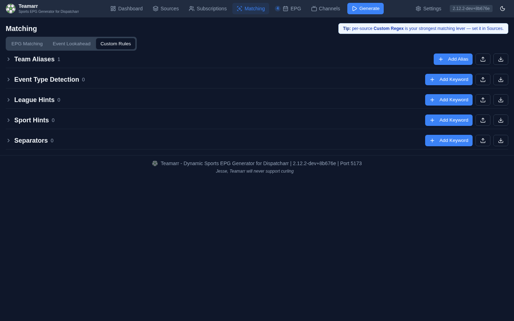

# Matching

**Matching** is how Teamarr turns a raw stream name into a real event. When a stream is called `Niners @ Cowboys` or `DIRECTO España - Inglaterra`, the matcher decides which sport, league, teams, and event it belongs to.

The **Matching** page (`/matching`) has three views:

| View | What it holds |
|------|---------------|
| **EPG Matching** *(default)* | Global tuning for [EPG program matching](program-matching): Provider EPG Backup, Attach/Detach Timing, and Dispatcharr as a Stream Source |
| **Event Lookahead** | How far ahead streams are matched to events |
| **Custom Rules** | The tunable classification library — team aliases, event-type keywords, league/sport hints, and separators |

{: .tip }
> Per-source [Custom Regex](../sources/creating-groups#custom-regex) is your strongest matching lever — if one source's naming is the problem, fix it there in the source editor rather than with global rules.

## EPG Matching

Global settings for matching static linear channels (ESPN, FS1) to events via Dispatcharr's program guide:

- **Provider EPG Backup** — opt-in fallback to an Xtream (XC) provider's own EPG for streams Dispatcharr has no guide for, with a **Cache for (hours)** control (default 24).
- **Attach/Detach Timing** — **Attach before (minutes)** / **Detach after (minutes)** buffers (default 60/60) controlling the time-share window around each matched program.
- **Dispatcharr as a Stream Source** — opt-in additive source that matches streams already curated onto Dispatcharr channels using each channel's own EPG, with a **Dispatcharr groups to include** picker.

The feature itself is enabled per source; see the full [EPG Program Matching guide](program-matching) for how it works and every setting's detail.

## Event Lookahead

Controls how far ahead Teamarr matches streams to sporting events — streams are matched only to events within this window. Default is **3 days**; options are 1, 3, 7, 14, or 30 days. A shorter window means fewer candidate events per run and faster generation.

## Custom Rules

The classification library, in stacked collapsible sections (previously the **Detection Library**): **Team Aliases**, **Event Type Detection**, **League Hints**, **Sport Hints**, and **Separators**. Each section shows its entry count and has its own **Add**, **Import**, and **Export** actions.

### Team Aliases

Map alternate team names to their official names. IPTV providers often use shortened or unofficial team names (e.g., "Niners" instead of "San Francisco 49ers"). Aliases tell Teamarr to treat them as the same team.

| Column | Description |
|--------|-------------|
| **Alias** | The alternate name that appears in stream names |
| **Maps To** | The official team name it resolves to |
| **League** | Which league the alias applies to |
| **Actions** | Delete button |

To add one: **Add Alias** → enter the alias text → select a league to filter the team list → select the team → **Create**.

{: .note }
> Aliases can't be edited in place or toggled — they're active until deleted; to change one, delete and recreate it.

Your aliases sit on top of a built-in alias set that ships with Teamarr — user aliases take precedence over built-ins, so you can override a built-in mapping by creating your own. National teams also resolve through automatic country-name recognition ("brasil" → Brazil), so most country-name variants need no alias at all.

### Event Type Detection

Keywords that identify fight-card / event-style streams. The effective **Target Value** is `EVENT_CARD` — a keyword like `Fight Night` tells Teamarr the stream is a card event rather than a team matchup. (The form also offers `TEAM_VS_TEAM` and `FIELD_EVENT`, but neither does anything today: team-vs-team is detected via separators, not keywords, and `FIELD_EVENT` is reserved for future use.)

| Column | Description |
|--------|-------------|
| **Keyword/Pattern** | The keyword or regex pattern to match |
| **Target** | What the keyword maps to |
| **Type** | Text (literal match) or Regex (pattern match) |
| **Priority** | Higher numbers are checked first |
| **Status** | On/Off — disabled keywords are skipped |
| **Actions** | Toggle, Edit, Delete |

### League Hints

Keywords that identify which league a stream belongs to. When a stream name contains a league hint keyword, Teamarr narrows its event search to that league.

| Keyword | Target | Effect |
|---------|--------|--------|
| `UCL` | `uefa.champions` | Streams with "UCL" match Champions League events |
| `La Liga` | `esp.1` | Streams with "La Liga" match Spanish Primera Division |
| `CFL` | `cfl` | Streams with "CFL" match Canadian Football League |

Table columns are the same as Event Type Detection, with the **Target** showing the league code.

### Sport Hints

Keywords that identify which sport a stream belongs to. Sport hints are checked when no league hint is found, providing a broader classification.

Some keywords are ambiguous across sports — "football" could mean American Football or Soccer. Sport hints support **comma-separated targets** to map one keyword to multiple sports:

| Keyword | Target | Effect |
|---------|--------|--------|
| `football` | `Soccer, Football` | Tries matching against both Soccer and Football events |
| `footy` | `Soccer` | Only matches Soccer events |
| `hoops` | `Basketball` | Only matches Basketball events |

When entering multiple sports, separate them with commas. They display as individual badges in the table.

### Separators

Matchup delimiters that split a stream name into two teams. Teamarr ships with built-in separators (`vs`, `@`, `at`, `x`, `contra`, and others), and this section lets you add locale-specific ones your provider uses.

The most common reason to add one is the **hyphen** used by Spanish and other European EPGs:

| Stream name | Needs separator | Result |
|-------------|-----------------|--------|
| `España - Inglaterra` | ` - ` | Splits into `España` vs `Inglaterra` |

{: .warning }
> Keep the surrounding spaces (`" - "`, not `"-"`) and add hyphen-style separators sparingly. A bare hyphen with no spaces matches inside ordinary words and hyphenated names, causing streams to be split incorrectly. Teamarr preserves the exact spacing you type for separators.

Separators are the one keyword category with no **Target Value** — the field is hidden for them.

{: .note }
> Live-broadcast prefixes such as `DIRECTO`, `EN DIRECTO`, `EN VIVO`, `AO VIVO`, `DIRETTA`, and `DIREKT` are stripped automatically during matching, so a stream like `DIRECTO España - Inglaterra` is read as `España - Inglaterra`. You don't need to configure these.

### Keyword Fields

All keyword sections (Event Type, League Hints, Sport Hints, Separators) share the same create/edit form:

| Field | Description |
|-------|-------------|
| **Keyword/Pattern** | The text or regex to match in stream names |
| **Regular expression** | Toggle between literal text matching and regex |
| **Enabled** | Whether this keyword is active |
| **Target Value** | What the keyword maps to (event type, league code, or sport name). Hidden for Separators |
| **Priority** | Numeric priority — higher values are checked first |
| **Description** | Optional notes about the keyword |

Click the toggle icon in the Actions column to enable or disable a keyword without deleting it. Disabled keywords appear dimmed and are skipped during stream classification.

### Import & Export

Each section has its own **Import** and **Export** actions — useful for sharing configurations or backing up your matching rules. Export downloads that section's data as JSON (`detection-keywords-<category>.json`, `team-aliases.json`). Import reports what happened: keyword imports show created/updated counts (with a warning for any failures); alias imports show created/skipped counts.

{: .tip }
> Export your matching library before making major changes. If something goes wrong with matching after editing keywords, you can re-import the backup.

## All-Star Games

League All-Star exhibitions (the MLB All-Star Game, the MLS All-Star Game, and others) are matched automatically — there's nothing to configure. Providers name these streams generically, like `MLB All-Star Game`, which carries no real matchup. Teamarr recognizes the **"All-Star"** keyword together with a **league hint** and resolves the stream to that league's single All-Star event for the day.

This works without hardcoding the teams, so it keeps working as the yearly opponent changes (for example, the MLS All-Stars face a different side each summer). It relies on the data provider listing both sides of the game as All-Star squads — the case for MLB and MLS. Leagues whose provider names the sides differently (divisions or captain-picked teams) aren't recognized this way.

{: .note }
> An All-Star stream still needs **Stream Name** matching enabled on its source, and the league must be in your subscription (or the source's override).
