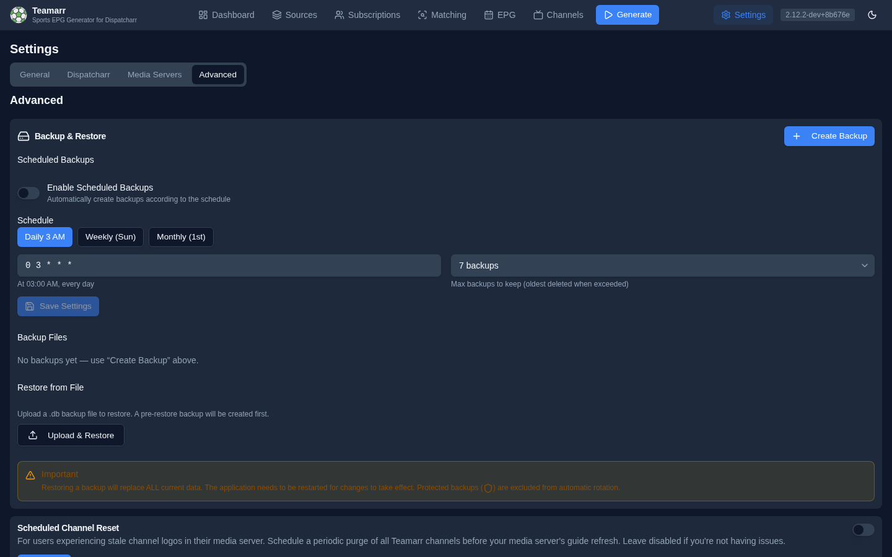

# Advanced

Backup & restore (including scheduled backups), scheduled channel reset, Gracenote category overrides, and the data caches.

## Backup & Restore

A backup is a **complete copy of the Teamarr database** — teams, templates, sources, settings, history, everything. The card has three sub-sections:

### Scheduled Backups

Automatic backups on a cron schedule:

| Field | Description |
|-------|-------------|
| **Enable Scheduled Backups** | Toggle the schedule on/off |
| **Schedule (Cron Expression)** | Standard cron; presets: Daily 3 AM (`0 3 * * *`), Weekly Sun (`0 3 * * 0`), Monthly 1st (`0 3 1 * *`) |
| **Max backups to keep** | 3 / 5 / 7 / 14 / 30 — the oldest backup is deleted when the limit is exceeded |

Backups are written to `./data/backups` (the path is settable via `PUT /backup/settings`; no UI field).

### Backup Files

**Create Backup** takes a manual backup on demand. A dropdown below lists your backups; selecting one shows its size, date, and **manual**/**scheduled** type badge, with actions for the selected file:

- **Download** the file
- **Restore** from it
- **Protect/unprotect** — a protected backup is excluded from rotation and can't be deleted
- **Delete**

### Restore from File

Upload a `.db` backup file to restore. A backup of your current data is automatically created first (its path is shown in the confirmation toast).

{: .warning }
Restoring a backup replaces ALL current data. Restart the application after a restore.

## Scheduled Channel Reset

For users experiencing stale channel logos in their media server (e.g. Jellyfin). Schedule a periodic purge of all Teamarr channels before your media server's guide refresh; the channels are recreated on the next EPG generation. Leave disabled unless you're seeing this problem.

| Field | Description |
|-------|-------------|
| **Enable Scheduled Channel Reset** | Toggle the periodic reset on/off |
| **Reset Schedule (Cron Expression)** | Standard cron format; presets at 2:30 / 3:30 / 4:30 / 5:30 AM. A plain-English description confirms the expression |

{: .note }
Set this to run shortly *before* your media server's scheduled guide refresh.

## Gracenote Category Overrides

Customize what the `{gracenote_category}` template variable renders for any league — the value professional guides use as the program title ("NFL Football", "NASCAR Cup Series"). Two facts worth knowing: overrides **survive Teamarr updates** (built-in league data is re-seeded on every startup; overrides live separately and always win), and clearing an override restores the built-in value, which is shown alongside each entry.

## Logging

**Console log level** changes the verbosity of the console/`docker logs` stream at runtime — no restart needed. Pick DEBUG for temporary troubleshooting, *arr-style.

Two things to know:

- **It's temporary by design.** A restart returns to the `LOG_LEVEL` environment default (INFO unless overridden). If you want a permanently different level, set `LOG_LEVEL` instead.
- **The log file always captures DEBUG.** `data/logs/teamarr.log` records full debug detail at all times regardless of this setting — if something already went wrong, the debug trail is on disk.

## Data Caches

Teamarr maintains several caches, each with a tile and a clear/refresh action. Tiles show live counts where available; the Directory tile also shows the last refresh time, duration, and any error.

| Cache | Contents | Action |
|-------|----------|--------|
| **Team & League Directory** | Cached teams and leagues from ESPN and TheSportsDB (enables offline matching) | **Refresh Directory** — pull the latest team/league data. A *Directory Stale* badge appears when the directory is over a week old |
| **Game Data Cache** | Schedules, scores, and odds (shows active entries and pending writes) | **Clear Game Cache** |
| **Stream Match Cache** | Stream-to-event fingerprint matches | **Clear Match Cache** |
| **Run History** | Processing-run logs and statistics (auto-cleaned to 30 days after each run) | **Clear Run History** |

{: .note }
The Team & League Directory refreshes automatically on **every startup** unless the `SKIP_CACHE_REFRESH` environment variable is set. Manual refresh is useful after adding new leagues or when team rosters change significantly. Clearing the game-data or match caches forces fresh lookups on the next generation run.
