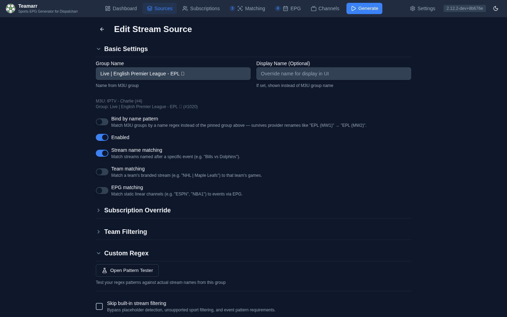
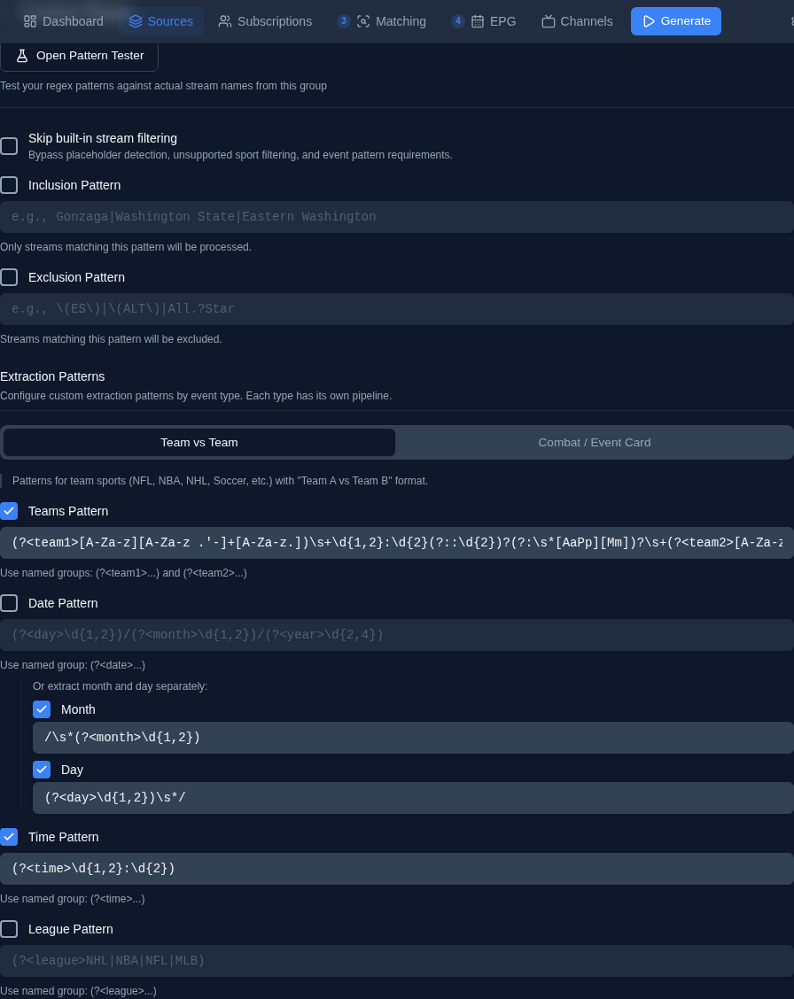

# Adding a Source

Sources connect M3U stream groups to Teamarr's sports data. Each source pulls streams from a Dispatcharr M3U group and matches them to real sporting events.

New sources are created from the [import screen](index#importing-sources) (**Add Stream Source**), which pins the source to an M3U group — you don't pick an account or group inside the editor. The editor has five sections: **Basic Settings**, **Subscription Override**, **Team Filtering**, **Custom Regex**, and **Stream Timezone**.

Channel numbering, channel groups, and channel profiles are *not* per-source settings — they're configured globally (with per-league overrides) under [Channels → Numbering](../channels/numbering) and [Channels → Output](../channels/output).

## Basic Settings

- **Group Name** — the M3U group this source is bound to (read-only; set at import).
- **Display Name** *(optional)* — a friendlier name to show in Teamarr instead of the raw group name.
- **Bind by name pattern** *(edit mode only)* — bind the source to a regex over live group names instead of the exact pinned name, with a live **"Matches N groups"** preview. Makes the source survive provider group renames — see [Binding by Name Pattern](index#binding-by-name-pattern).
- **Enabled** — toggle the source on/off without deleting it. Disabled sources are skipped during generation.
- **Matching types** — three independent toggles; at least one must be on (see [Matching Types](index#matching-types)):
  - **Stream name matching** — match streams whose names identify a specific event (`Bills vs Dolphins`).
  - **Team matching** — team-branded streams (e.g. `NHL | Toronto Maple Leafs`) match every event that team plays in the lookahead window. Built-in stream filtering is bypassed for the whole source.
  - **EPG matching** — static linear channels (`ESPN`, `NBA1`) match events via Dispatcharr's program guide and are time-shared across event channels. Built-in filtering is bypassed. See [EPG Program Matching](../matching/program-matching).

## Subscription Override

By default, sources inherit the global [Subscription](../subscriptions). To override:

1. Edit the source
2. Under **Subscription Override**, uncheck **Use global subscription**
3. The picker automatically seeds from your current global subscription
4. Deselect any leagues or sports you want to exclude, then save

Use **Match Global** at any time to reset the picker back to the current global subscription and start over.

This is useful when a stream source mixes sports and you need to exclude specific leagues from it — for example, excluding MLB from a multi-sport source where the provider labels all streams with the same channel format regardless of sport.

{: .warning }
> An override fully **replaces** the global league set for that source — a league missing from the override won't match here even if globally subscribed.

## Team Filtering

Narrow this source's matches to specific teams:

- **Use default team filter** — inherit the global filter from [Subscriptions → Teams](../subscriptions#default-team-filter).
- Or define a source-specific filter: choose **Include only selected teams** or **Exclude selected teams**, then pick teams.
- **Include all playoff & All-Star games** — bypass the team filter for postseason and All-Star events, so you never miss them.

## Custom Regex

Controls how this source's streams are filtered and parsed.

### Stream filters

- **Skip built-in stream filtering** — bypass Teamarr's built-in non-sport filters for this source (automatic when Team or EPG matching is on).
- **Inclusion Pattern** — only process streams matching this regex.
- **Exclusion Pattern** — skip streams matching this regex.

Each is a checkbox that reveals a pattern input when enabled.

### Extraction Patterns

Override how Teamarr parses stream names. By default the built-in classifier handles most formats; use custom patterns when your provider's naming is unusual. Patterns are organized in two tabs by event type:

| Tab | Patterns |
|-----|----------|
| **Team vs Team** | Teams, Date (with optional Month/Day sub-patterns), Time, League |
| **Combat / Event Card** | Fighters, Event Name, Date (with Month/Day), Time |

Each pattern has an enable checkbox — leave it unchecked to use the built-in parser for that field.

Named groups accept both `(?<name>...)` and Python's `(?P<name>...)` syntax. The recognized names are `team1`/`team2` (Teams), `fighter1`/`fighter2` (Fighters), `date` or `month`/`day`/`year` (Date), `time` or `hour`/`minute`/`ampm` (Time), `league` (League), and `event_name` (Event name). When the recognized named groups are present they take precedence, so extra unnamed groups — like a `(vs|v)` separator — are safe. Without named groups, the first capture group is used (first two for Teams/Fighters).

**Date patterns describe a format, not a literal date.** The best way to write one is with component groups that declare the format structurally — `(?P<day>\d{1,2})/(?P<month>\d{1,2})/(?P<year>\d{2,4})` says "day-first, then month, then year" and can never be misread. A single `(?P<date>...)` blob also works: Teamarr learns the source's format from the whole group before matching (one `16/07` in the list proves the source is day-first, so `05/07` parses as July 5). When the format can be verified this way, the date strictly gates candidate games (±1 day for provider-timezone boundaries) and a mismatch is reported as `date_mismatch`; when it can't be verified, the date only ranks candidates — it never blocks team matching outright.

**Tennis groups** use the **Teams** patterns for player pairs — the two named groups become player 1 and player 2 (surname-based matching handles tournament prefixes and extra tokens). The built-in parser also recognizes the `Surname, First - Surname, First` provider format without any configuration.

### Pattern Tester

When editing an existing source, the **Open Pattern Tester** button (edit mode only) opens a workspace that runs your patterns against the group's real stream names. Highlighting is instant client-side JavaScript regex, and each stream also gets a **pipeline verdict badge** computed by the real Python extraction functions: green `✓ pipeline` means the pattern fully extracts (both teams captured, date/time actually parseable); yellow `✗` lists the fields the pipeline would reject even if the regex visually matches. Invalid Python patterns are called out in a banner. Hover a badge to see the extracted values.

The tester also helps you *build* patterns: select text in a stream name to generate a pattern interactively, watch the **learned date format** banner confirm what Teamarr inferred from the samples, and click **Apply to Form** to copy the working patterns back into the editor.

## Stream Timezone

Optional. Declares the timezone of dates/times embedded in this source's stream names. Timezone markers in the names themselves (e.g., "ET", "PT") are auto-detected — set this only if your provider omits them and uses a different timezone than yours.
