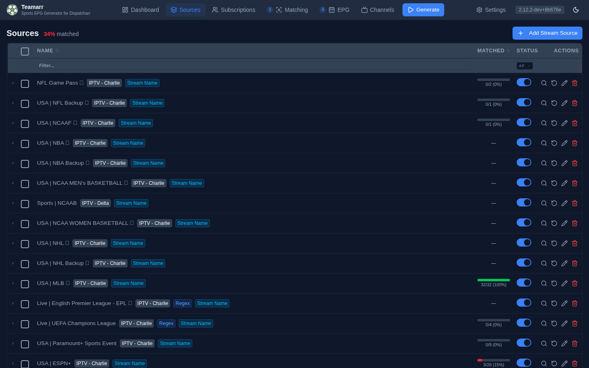
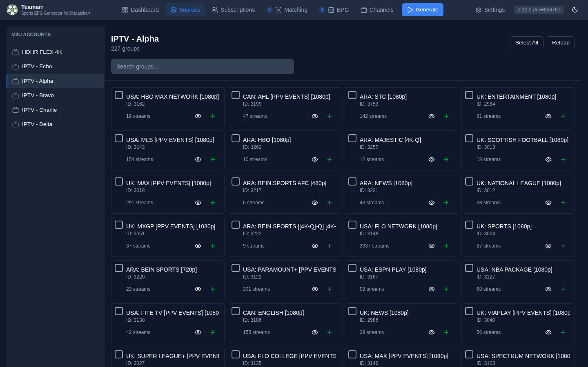

# Sources

A **Source** is an IPTV stream group that Teamarr matches to real-world sporting events. Event channels are dynamic: unlike a persistent linear channel, an event channel appears when a game is about to start and disappears after it ends.

{: .note }
> Sources were called **Event Groups** before v2.7.0. The app route is now `/sources`. Settings that used to live under *Settings → Event Groups* are split across the Source editor, the [Matching](../matching/) page (EPG-matching tuning, Event Lookahead), and [Channels](../channels/) (numbering, groups, profiles).

## How It Works

1. Your IPTV provider delivers streams organized into groups (e.g., "NFL", "ESPN+", "DAZN")
2. You import these stream groups into Teamarr as **Sources**
3. Teamarr parses each stream name, matches it to a real sporting event, and creates a channel with rich EPG data
4. Channels are created in Dispatcharr with proper names, logos, EPG data, and group/profile assignments

Which leagues a source scans is governed by your global [Subscription](../subscriptions) — configured on the **Subscriptions** page, not here. A source can [override the subscription](creating-groups#subscription-override) with its own league set when needed (e.g., a hockey-only source that shouldn't scan for football events).

## The Sources Table

The Sources page header shows an overall **X% matched** summary and the **Add Stream Source** button. The table lists every configured source:

| Column | Description |
|--------|-------------|
| *(drag handle)* | Drag rows to reorder — the order sets each source's processing order and auto channel allocation |
| *(checkbox)* | Multi-select for the bulk action bar |
| **Name** | Source name, M3U account, and a color-coded badge per active matching type (plus a **Regex** badge when custom regex is configured — team-vs-team extraction patterns or include/exclude stream filters) |
| **Matched** | Stream coverage — how many of the source's eligible streams matched at least one event, as a 0–100% bar. Hover for total *matches produced* and the last-run timestamp |
| **Status** | Enable/disable toggle |
| **Actions** | Preview matches, clear cache, edit, delete |

Column headers sort, and a filter row narrows the list by name and status. Selecting rows raises a bulk action bar: **Enable**, **Disable**, **Clear Cache**, **Edit** (bulk-edit shared settings), and **Delete**. When stale sources exist, a **Delete all stale** action appears.

To see *which* streams matched or failed (and fix failures manually), use the **Matched**/**Failed** drill-downs in the [Dashboard](../dashboard)'s run history — the Sources table shows rates, not per-stream detail. The per-source **preview** button shows current stream matches without running a full generation.

{: .note }
> The percentage is **stream coverage**: distinct streams matched ÷ eligible streams (always 0–100%). The hover tooltip shows **matches produced** — the total number of stream→event matches. With [EPG matching](../matching/program-matching), one linear stream (ESPN, FS1…) is time-shared across many events, so matches produced can far exceed the stream count. These are tracked separately so coverage stays a true health signal.

## Importing Sources

Click **Add Stream Source** to open the import screen. It lists your Dispatcharr M3U accounts in a sidebar; selecting one shows its stream groups with stream counts.

From there:

- **Preview** (eye icon) shows a group's streams before importing.
- **Single import** (+ icon) opens the full source editor for that group.
- **Import N Groups** imports your selection in bulk, via a modal that sets the shared settings up front: Stream Timezone, Enabled, and the three matching types (Stream name matching, Team stream source, EPG program matching).

## Binding by Name Pattern

Some IPTV providers rotate group names — `EPL (MW1)` becomes `EPL (MW2)`, dated tournament groups come and go. Dispatcharr matches M3U groups by exact name, so a provider rename always creates a **new** group and a source pinned to the old one silently stops finding streams.

**Bind by name pattern** (in the source's Basic Settings) makes the source rename-proof: instead of the pinned group, the source binds to a regular expression over live M3U group names, re-resolved on every generation run. A pattern like `EPL \(MW\d+\)` keeps matching no matter which matchweek the provider is on. If the pattern matches several groups at once, the source scans all of them (scoped to its M3U account), and while a renamed group's old and new versions briefly coexist, stale streams from the old one are filtered out automatically.

The editor shows a live **"Matches N groups"** preview as you type. A pattern that matches nothing means the source is treated as stale — same as a missing pinned group.

A stale pattern never deletes your channels: when it matches nothing, the source simply skips the run and existing channels stay until their normal post-event expiry. If the pattern still matches *some* groups but misses one (say a rename escaped your regex), streams from the missed group are treated like streams removed from the M3U — they're detached on the next run, and a channel is removed only once no streams are left on it.

### Re-imported M3U Accounts

Deleting and re-adding an M3U account in Dispatcharr gives it a **new account ID**, which leaves every source that was bound to it pointing at an ID that no longer exists — the source looks configured but resolves to zero streams. Teamarr repairs this on its own: each generation run re-resolves a source's stored account ID against the live M3U accounts and, when the account name still matches, updates the source to the new ID. The Streams view also falls back to showing the group's streams unfiltered while the stored ID is stale, so a re-imported account never leaves the source looking empty.

### Re-bind Suggestions

When a source goes stale, Teamarr scans the live M3U groups for a likely rename — an unused group whose name closely matches the old one — and offers it right in the stale-sources banner:

- **Re-bind** — one click pins the source to the new group (and turns pattern binding off, so the pin is what's actually used).
- **Re-bind + pattern** — also derives a pattern from the old/new name difference (`EPL (MW1)` → `EPL (MW2)` suggests `^EPL \(MW\d+\)$`) and enables pattern binding with it, so the *next* rename re-binds automatically.

Suggestions are never applied silently — the suggested pattern is shown before you click, and you can always fine-tune it later in the source editor with the live match preview. Re-binding only updates the source's binding; existing channels are untouched.

## Stream Matching Pipeline

When EPG generation runs, each stream goes through:

1. **Filtering** — include/exclude regex, built-in filters for non-sport content
2. **Classification** — parse stream name to extract teams, league, date, time
3. **Matching** — find the corresponding real-world event from provider data
4. **Channel creation** — create/update the Dispatcharr channel with EPG data

Streams that can't be matched appear in the **Failed** count of the [Dashboard](../dashboard)'s run history. Click it to see each stream's failure reason and use **Fix** to manually link a stream to an event.

## Matching Types

Each Source declares which matching pipeline(s) it runs. The three types are **independent** — enable any combination, and each stream is routed to whichever applies. Every Source must have at least one enabled. The Sources table shows a color-coded badge per active type.

| Type | Badge | Matches | Example |
|------|-------|---------|---------|
| **Stream Name** | sky | Streams whose name identifies a specific event | `Bills vs Dolphins`, `DAZN: Man City vs Arsenal` |
| **Team** | emerald | A team's branded stream → that team's games in the window (one stream → many events) | `NHL \| Toronto Maple Leafs` |
| **EPG** | violet | Static linear channels → events via Dispatcharr's program guide, time-sharing one stream across events | `ESPN`, `NBA1` |

A separate blue **Regex** badge marks sources with custom extraction patterns configured.

{: .note }
> A Source that does **only** Team or EPG (Stream Name off) shows a raw stream **count** in the Matched column instead of a coverage percentage — those types fan one stream out to many events, so a `matched ÷ total` percentage isn't a meaningful health signal.

Set the types in the source editor — the toggles are labeled **Stream name matching**, **Team matching**, and **EPG matching** — or at bulk import / bulk edit (labeled *Stream name matching* / *Team stream source* / *EPG program matching* there).

### EPG Program Matching

Linear channels (ESPN, FS1) carry many games a day under one static name, so they can't be matched by name. **EPG matching** reads Dispatcharr's program guide instead and time-shares one linear stream across many event channels near game time. Enable it per source; the global tuning (attach/detach buffers, provider-EPG backup, Dispatcharr-as-a-source) lives on the [Matching page](../matching/) under **EPG Matching**. Full guide: [EPG Program Matching](../matching/program-matching).

## Event Matching Window

The **Event Lookahead** (on the [Matching](../matching/) page) controls how far ahead Teamarr matches streams to sporting events — streams are matched only to events within this window. Default is 3 days; options are 1, 3, 7, 14, or 30 days.

**Tennis: majors only** ([Subscriptions → Teams](../subscriptions#default-team-filter), next to the playoff bypass; shown when subscribed to ATP/WTA) restricts tennis matching to the four Grand Slams (Australian Open, French Open, Wimbledon, US Open). Smaller ATP/WTA tournaments are ignored entirely — no channels are created for them. Off by default.

## Exception Keywords

Streams matching configured exception keywords (e.g. a "Spanish" feed of the same game) can be sub-consolidated, separated, or ignored instead of following the default consolidation behavior. These are configured globally on [Channels → Consolidation](../channels/consolidation#exception-keywords).

See [Adding a Source](creating-groups) for the full source editor reference.
