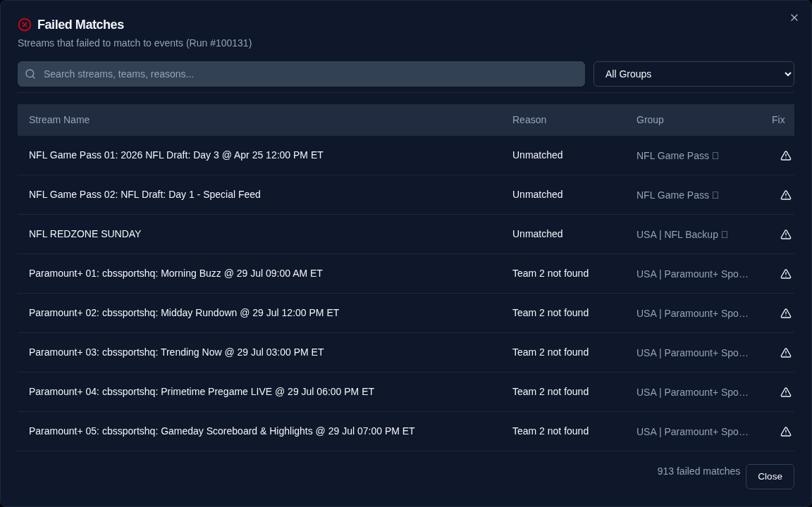

# Troubleshooting

Common issues and how to resolve them.

## Stream Matching

### Streams show as "Failed" after generation

Failed streams couldn't be matched to a real sporting event. Click the **Failed** count in the Dashboard's run history to see each stream's failure reason, and use **Fix** to manually match a stream to an event.



Common causes:

- **Stream name too vague** — Names like "Sports 1" or "NBA 3" don't contain team names. Teamarr needs identifiable team or event information (or [EPG program matching](matching/program-matching) for linear channels).
- **League not subscribed** — The stream's league isn't in your [Subscription](subscriptions) (or a Source's subscription override). This is the most common cause — add the league under Subscriptions and regenerate. Newly-created custom leagues are auto-subscribed, but check the Custom Leagues list for a **Not subscribed** badge.
- **Team name mismatch** — Your IPTV provider uses a non-standard name. Add a team alias under [Matching → Custom Rules](matching/) to map it to the official name.
- **Date mismatch** — Streams with dates in DD/MM format may be parsed as MM/DD. Use [custom regex extractors](sources/creating-groups#custom-regex) with named groups (`(?P<day>...)/(?P<month>...)`) to teach Teamarr the format.

### Streams matching the wrong event

- Click the **Matched** count in the Dashboard's run history and use **Fix** on the wrong match to correct it manually — the correction persists as a "User Fixed" match
- Check [Matching → Custom Rules](matching/) for conflicting league or sport hints
- Verify your stream filters (include/exclude regex) aren't too broad
- Use the preview button on the [Sources](sources/) page to see matches without running a full generation

## Channels

### Channels not appearing in Dispatcharr

1. Verify Dispatcharr integration is connected (Settings → Dispatcharr shows "Connected")
2. Verify an EPG source is selected
3. Run EPG generation and check if streams matched successfully
4. Check [channel lifecycle timing](channels/lifecycle) — channels may not be created yet based on your create timing settings

### Channels disappearing unexpectedly

- Check [delete timing](channels/lifecycle) — channels are deleted based on post-event buffer settings
- Review the **Recently Deleted** section on the [Dashboard](dashboard)
- With "Same day" delete timing, channels are removed at the end of the event's day; events that run past midnight fall back to the post-event buffer

### Channels show red in Dispatcharr

For an **EPG-matched** event channel, **red is usually normal** — it just means no stream is attached *right now*. EPG matching attaches a linear stream (ESPN, FS1…) only within a window around the matched program, controlled by the **Attach before** / **Detach after** buffers on the [Matching](matching/) page (default 60 min each). Outside that window the stream is intentionally detached and the channel goes red. Red *during* an event's window is worth investigating — see [Why some channels show red in Dispatcharr](matching/program-matching#why-some-channels-show-red-in-dispatcharr).

### Channel numbers colliding with existing channels

Teamarr automatically skips numbers used by non-Teamarr channels, but for a clean block set the **Everything Else Start** in [Channels → Numbering](channels/numbering) to a range that doesn't overlap your existing Dispatcharr channels.

### Stale logos in media server

Some media servers (particularly Jellyfin) cache channel logos aggressively. Enable **Scheduled Channel Reset** in [Settings → Advanced](settings/advanced) to periodically purge and recreate channels before your media server's guide refresh.

## Dispatcharr Connection

### "Connection error" when testing

- Verify the URL includes the protocol (`http://` or `https://`)
- Check that Dispatcharr is running and accessible at the specified port
- If using Docker, ensure both containers are on the same network or use the correct IP/hostname
- Check for firewalls blocking the port

### EPG source dropdown is empty

You need to add Teamarr's XMLTV URL as an EPG source in Dispatcharr first. Copy the **EPG URL** from the [Dashboard](dashboard) status strip and add it in Dispatcharr's EPG sources.

## Generation

### Generation takes too long

- Reduce **Event Lookahead** on the [Matching](matching/) page (shorter window = fewer events to check)
- Reduce **Schedule Days Ahead** under [EPG → Team EPG](epg/teams) (fewer days = less schedule data)
- Use per-Source subscription overrides to limit which leagues each source scans
- Refresh the team/league directory if it's stale (Settings → Advanced → Data Caches → **Refresh Directory**)

{: .tip }
The **API Calls** column in the Dashboard's run history shows provider calls per channel. Healthy runs sit in the low single digits; an amber/red value means something is refetching abnormally and is worth a bug report.

### Generation fails or shows errors

Check the logs for details:

```bash
# Docker
docker logs --tail 200 teamarr

# Log file (inside container or data volume)
tail -n 200 data/logs/teamarr.log
```

Common causes:
- Network timeout reaching ESPN or TSDB APIs
- Dispatcharr API returning errors (check Dispatcharr logs too)
- A generation is already running — concurrent runs are refused; wait for the active run to finish

## Database & Upgrades

### Startup crash after upgrade

If Teamarr fails to start after pulling a new image, check the logs for migration errors. **Never delete `teamarr.db`** — it contains all your configuration; migrations handle schema changes automatically. If startup still fails, file a bug report with the error message.

### Restoring a backup

Go to [Settings → Advanced](settings/advanced) → Backup & Restore. Upload a `.db` backup file. A backup of your current database is created automatically before restoring. The application needs to be restarted after restore.

## Logs

Teamarr writes to two log files in the `data/logs/` directory:

| File | Contents | Rotation |
|------|----------|----------|
| `teamarr.log` | All log messages (DEBUG and above) | 10 MB x 5 files |
| `teamarr_errors.log` | Errors only | 10 MB x 3 files |

The console log level is controlled by the `LOG_LEVEL` environment variable (default: `INFO`). File logs always capture `DEBUG` regardless of this setting.

```bash
# View recent logs
docker logs --tail 100 teamarr          # Console output
docker exec teamarr cat data/logs/teamarr.log | tail -100  # Log file
```

## Getting Help

### Support bundle

Use **Support bundle** in the footer to download a redacted diagnostic ZIP. Attach the ZIP to a support request instead of a database backup. It includes configuration, source and subscription diagnostics, the matching library (aliases, detection and exception keywords, condition presets, persistent corrections, and source-template mappings), recent run and match details, managed-channel ordering evidence, and bounded log excerpts. Stream URLs, M3U account names, passwords, API keys, tokens, template bodies, XMLTV, and provider caches are excluded. Redaction also applies inside JSON-typed settings such as the Emby and Jellyfin server lists.

The report opens with automatic **signals** — things worth checking before reading further: Dispatcharr disabled, no enabled sources, active teams without a template, the latest generation not completing, a media server whose refresh has failed on consecutive runs (`media_server_refresh_failing`, with the server and last error as evidence), sources that matched none of their streams (`source_matching_zero`) or under half of them (`source_matching_degraded`, info), and no managed channels stored.

The two matching signals read the per-source breakdown on the most recent completed run. A source is only reported once it had at least 10 streams left after filtering — the denominator is streams the matcher was actually asked about, so a source that is merely out of season (streams fetched, all filtered out) stays quiet. Each lists the worst offenders by stream count plus a total, because on a large install a handful of sources legitimately match nothing: generic channel groups like a news or a general-entertainment feed have no fixtures to find.

- **GitHub Issues**: [github.com/Pharaoh-Labs/teamarr/issues](https://github.com/Pharaoh-Labs/teamarr/issues)
- **Discord**: Join the Dispatcharr Discord server — there's a Teamarr channel
