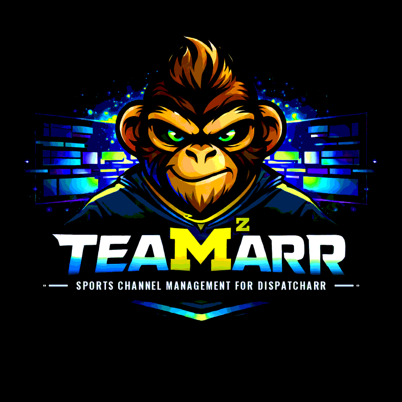

<div style="text-align: center; margin-bottom: 2rem;">
  
</div>

## What is Teamarr?

Teamarr is an add-on for [Dispatcharr](https://github.com/Dispatcharr/Dispatcharr) that generates enriched EPG for sports channels. It pulls rich sports data from providers (ESPN, TheSportsDB, HockeyTech, MLB Stats, NASCAR, Squiggle, and more) — schedules, venues, records, scores, standings, broadcasts — and uses it to manage your IPTV sports channels in Dispatcharr.

The workflow is simple: point Teamarr at your IPTV stream groups, tell it which leagues you follow, and it matches streams to real sporting events, creates and manages channels in Dispatcharr, and generates the guide. It works with several kinds of stream source:

- **Event streams** — ephemeral streams created for a single game (e.g. `NFL: Bills vs Dolphins`) that appear around game time and vanish afterward. Matched by stream name.
- **Team streams** — persistent channels dedicated to one team (e.g. "New York Yankees"), matched to that team's scheduled events.
- **Linear channels** — static-named channels (ESPN, FS1, TNT) whose game info lives in the program guide, not the stream name. Teamarr matches guide programs to events and time-shares the stream across event channels. See [EPG Program Matching](guide/matching/program-matching).

There is also a secondary **Team EPG** mode that generates a schedule-based guide for team channels you don't manage through the main workflow — see [Team EPG](guide/epg/teams).

**Example:**

Your IPTV stream says:
```
NFL: KC vs PHI
```

Teamarr matches it to real data and generates:
```
Channel: Chiefs vs Eagles - 6:30 PM ET
EPG:     Kansas City Chiefs @ Philadelphia Eagles
         Lincoln Financial Field, Philadelphia, PA
         Chiefs (11-1) vs Eagles (10-2)
         Broadcast: NBC, Peacock
```

**What Teamarr doesn't do:**

- **Create team-based channels** — Team channels are static and already exist in your IPTV provider. Teamarr only generates EPG for them.
- **Match incomplete event stream names** — If a stream name has no team or event information (e.g. just `NBA 1`) *and* no program-guide data to match against, Teamarr cannot identify the event.

## Features

- **174 pre-configured leagues across 15 sports**, plus ~228 more soccer leagues discovered live from ESPN — football, basketball, hockey, baseball, soccer, cricket, lacrosse, MMA, boxing, rugby, volleyball, Australian football, softball, racing (F1, NASCAR, IndyCar, IMSA, WEC), and tennis (ATP, WTA)
- **Custom leagues** — add any competition from TheSportsDB (premium key required)
- **258 template variables + chainable filters** — customize channel names and EPG with records, scores, venues, broadcasts, standings, playoff status, motorsports sessions, tennis context, and more
- **Flexible matching** — stream-name matching, team streams, and EPG program matching per source; aliases, fuzzy matching, and custom regex extractors for inconsistent IPTV naming
- **Channel management** — automatic create/update/delete lifecycle, numbering strategies, consolidation, feed separation, and stream priority rules
- **Dynamic groups & profiles** — use existing Dispatcharr groups/profiles or create them on the fly with `{sport}` / `{league}` wildcards
- **Media server integration** — trigger guide refreshes on Emby, Jellyfin, and Channels DVR (multiple servers, in parallel) after each generation
- **Artwork** — per-template art URLs with [Game Thumbs](guide/epg/game-thumbs) integration for matchup thumbnails
- **Scheduled automation** — cron-based generation, scheduled backups, and a [Homepage dashboard widget](guide/homepage-widget)

## Quick Links

- [User Guide](guide/) — get started with Teamarr
- [Technical Reference](reference/) — architecture and API documentation
